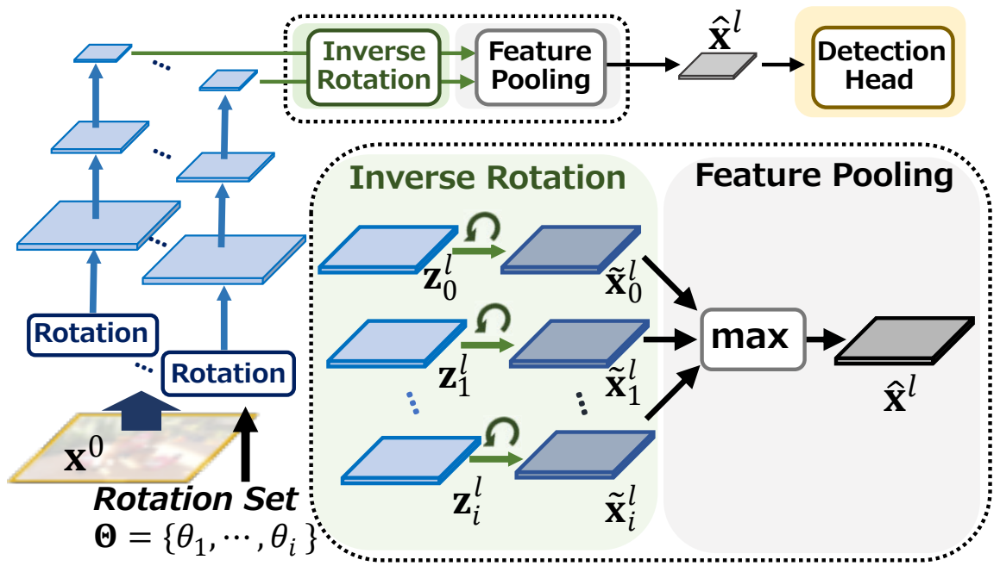

# COCO-ROT:Robustizing Object Detection Networks Using Augmented Feature Pooling (ACCV2022, Oral)
This is an official PyTorch impelementation of our paper  "[Robustizing Object Detection Networks Using Augmented Feature Pooling  (ACCV2022, Oral)](https://openaccess.thecvf.com/content/ACCV2022/papers/Shibata_Robustizing_Object_Detection_Networks_Using_Augmented_Feature_Pooling_ACCV_2022_paper.pdf)" 

<p align="center">

</p>

## Generate COCO-ROT-train/val with new randmon angles
`sh ./gen_COCO_ROT.sh`

## Generate COCO-ROT-train/val with same angles to our ACCV paper
`sh ./gen_COCO_ROT_accv.sh`

## Directory configuration
```
COCO-ROT    # This directry  
 ├── coco   # Please place your MSCOCO dataset here  
 │   ├── annotations  
 │   ├── train2017  
 │   ├── val2017  
 │   ├── test2017   
 |── coco-rot  
 │   ├── train2017  
 │   ├── val2017  
 │   ├── train2017_dbg  
 │   ├── val2017_dgb  
```

## Citation
If you use this toolbox or benchmark in your research, please cite this project.  
```BibTeX
@inproceedings{shibata2022robustizing,  
  title={Robustizing Object Detection Networks Using Augmented Feature Pooling},  
  author={Shibata, Takashi and Tanaka, Masayuki and Okutomi, Masatoshi},  
  booktitle={Proceedings of the Asian Conference on Computer Vision},  
  pages={2388--2405},  
  year={2022}  
}
```
